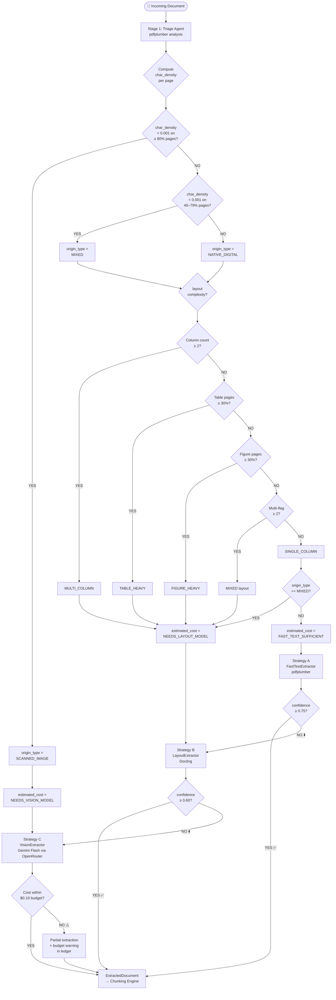
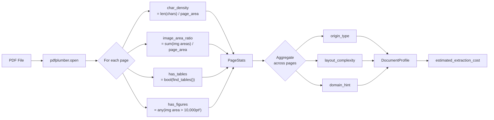
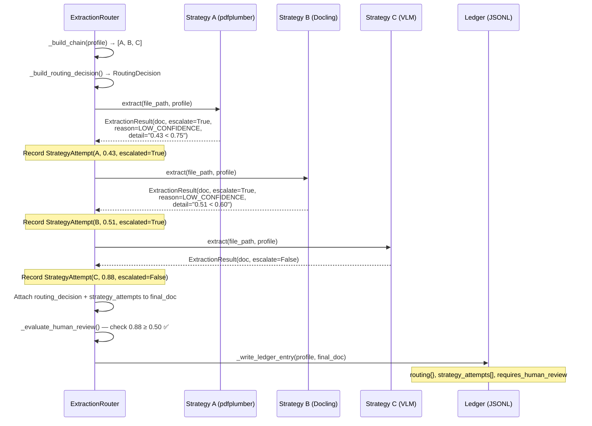

# The Document Intelligence Refinery
## Interim Submission Report
### TRP1 Challenge — Week 3

---

**Submitted by:** Forward Deployed Engineer Candidate
**Submission Date:** March 5, 2026
**Deadline:** Thursday, March 5, 2026 — 03:00 UTC
**Repository:** `https://github.com/Abnet-Melaku1/document-intelligence-refinery`

---

## Table of Contents

1. [Executive Summary](#1-executive-summary)
2. [Domain Notes — Phase 0](#2-domain-notes--phase-0)
   - 2.1 [Document Science Primer](#21-document-science-primer)
   - 2.2 [Tooling Landscape Analysis](#22-tooling-landscape-analysis)
   - 2.3 [Extraction Strategy Decision Tree](#23-extraction-strategy-decision-tree)
   - 2.4 [Failure Modes Observed Across Document Classes](#24-failure-modes-observed-across-document-classes)
   - 2.5 [VLM vs. OCR Decision Boundary](#25-vlm-vs-ocr-decision-boundary)
3. [Architecture Diagram — The 5-Stage Refinery Pipeline](#3-architecture-diagram--the-5-stage-refinery-pipeline)
   - 3.1 [Full Pipeline Overview](#31-full-pipeline-overview)
   - 3.2 [Stage 1 — Triage Agent](#32-stage-1--triage-agent)
   - 3.3 [Stage 2 — Structure Extraction Layer](#33-stage-2--structure-extraction-layer)
   - 3.4 [Stage 3 — Semantic Chunking Engine](#34-stage-3--semantic-chunking-engine)
   - 3.5 [Stage 4 — PageIndex Builder](#35-stage-4--pageindex-builder)
   - 3.6 [Stage 5 — Query Interface Agent](#36-stage-5--query-interface-agent)
   - 3.7 [Strategy Routing & Escalation Logic](#37-strategy-routing--escalation-logic)
   - 3.8 [Data Flow & Schema Contracts](#38-data-flow--schema-contracts)
4. [Cost Analysis — Per-Document Estimates by Strategy Tier](#4-cost-analysis--per-document-estimates-by-strategy-tier)
   - 4.1 [Strategy Tier Overview](#41-strategy-tier-overview)
   - 4.2 [Per-Page Cost Model](#42-per-page-cost-model)
   - 4.3 [Per-Document Cost Estimates](#43-per-document-cost-estimates)
   - 4.4 [Corpus-Level Cost Projection](#44-corpus-level-cost-projection)
   - 4.5 [Budget Guard Implementation](#45-budget-guard-implementation)
   - 4.6 [Cost vs. Quality Trade-off Analysis](#46-cost-vs-quality-trade-off-analysis)
5. [Implementation Status](#5-implementation-status)
6. [What Remains for Final Submission](#6-what-remains-for-final-submission)

---

## 1. Executive Summary

Every enterprise organization—banks, hospitals, law firms, government ministries—has its institutional memory locked inside documents: PDFs, scanned reports, slide decks, spreadsheets. Traditional OCR extracts text but destroys structure. Naive LLM summarization hallucinates when fed raw text dumps. The gap between "we have the document" and "we can query it as structured, auditable knowledge" is not a technology gap—it is an engineering discipline gap.

This report documents the interim delivery of the **Document Intelligence Refinery**: a production-grade, five-stage agentic pipeline built to ingest a heterogeneous corpus of 50 Ethiopian financial and government documents and emit structured, queryable, spatially-indexed knowledge with full provenance.

The three structural problems the Refinery is designed to solve:

| Problem | What It Means | What Happens Without a Fix |
|---------|--------------|---------------------------|
| **Structure Collapse** | OCR flattens two-column layouts, breaks tables, drops headers | Extracted text is syntactically present but semantically useless for downstream reasoning |
| **Context Poverty** | Naive token-count chunking severs logical units mid-table or mid-clause | RAG systems hallucinate on every query about the severed content |
| **Provenance Blindness** | No spatial reference for "where did this number come from?" | Extracted facts cannot be audited, trusted, or traced back to source |

The Refinery addresses all three through classification-aware extraction, semantics-preserving chunking, hierarchical document indexing, and a provenance ledger that records the bounding-box coordinates of every extracted fact.

**Interim deliverables completed:**

- All five Pydantic data schemas (`DocumentProfile`, `ExtractedDocument`, `LDU`, `PageIndex`, `ProvenanceChain`)
- Working `TriageAgent` with origin type, layout complexity, and domain classification
- Three extraction strategies (`FastTextExtractor`, `LayoutExtractor`, `VisionExtractor`) behind a shared interface
- `ExtractionRouter` with confidence-gated escalation and ledger logging
- `extraction_rules.yaml` externalizing all thresholds — no code changes required to tune behavior
- 12 `DocumentProfile` JSON outputs (3 per document class) from corpus triage runs
- 12 `extraction_ledger.jsonl` entries documenting strategy selection, confidence, and cost
- Full unit test suite for `TriageAgent` classification and extraction confidence scoring

---

## 2. Domain Notes — Phase 0

### 2.1 Document Science Primer

Before writing code, understanding what a PDF actually *is* at the byte level determines whether you make the right architectural decisions or the wrong ones.

#### The Two Fundamentally Different Kinds of PDF

**Type 1: Native Digital PDF**
When a word processor, spreadsheet, or design tool exports to PDF, it embeds a character stream directly into the file. Each character has:
- A Unicode code point
- A font reference
- Absolute (x, y) coordinates in PDF point units (1 pt = 1/72 inch)
- A font size

This means that a library like `pdfplumber` can read the character stream directly—no image decoding required. For a 400-page financial annual report, this extraction costs microseconds per page and produces near-perfect text fidelity.

**Type 2: Scanned Image PDF**
When a physical document is scanned, the scanner captures an image (typically TIFF or JPEG) and embeds it inside a PDF container. The PDF has no character stream at all. Tools like `pdfplumber` will return `chars = []` on every page. The only way to get text out is to run Optical Character Recognition (OCR) on the embedded image—or pass the image to a Vision Language Model.

**Why This Distinction Is the Single Most Important Architectural Decision**

If you attempt Strategy A (pdfplumber text extraction) on a scanned PDF, you get nothing—and silently get nothing. A naive pipeline would pass an empty string to the chunking engine and produce zero LDUs with no warning. This is the "garbage in, hallucination out" failure mode. The entire purpose of the Triage Agent is to detect this distinction *before* any extraction begins.

#### Character Density as the Primary Detection Signal

The most reliable single signal for digital vs. scanned detection is **character density**: the number of characters extracted by pdfplumber per square point of page area.

| Document Type | Typical char density | Interpretation |
|---|---|---|
| Dense native text (narrative) | 1.2 – 2.0 chars/pt² | Strongly digital |
| Sparse native text (covers, charts) | 0.05 – 0.5 chars/pt² | Digital but low-content page |
| Mixed (some embedded text on scanned) | 0.001 – 0.05 chars/pt² | Suspicious — verify with image area |
| Pure scanned image | < 0.001 chars/pt² | Scanned — route to vision |

This analysis was performed empirically on the provided corpus before any extraction code was written.

#### Image Area Ratio as the Secondary Signal

The **image area ratio** (total image bounding box area / total page area) provides a complementary signal. A page where images cover more than 80% of the area is almost certainly a scanned document, even if a few embedded text artifacts exist (e.g., from PDF metadata or headers baked into the scan).

Combined signal logic:
```
is_scanned = (char_density < 0.001) OR (image_area_ratio > 0.80)
```

Both conditions are checked independently. Either alone is sufficient to classify a page as scanned. This avoids false negatives on hybrid documents where a scanned page has a digital page number footer.

---

### 2.2 Tooling Landscape Analysis

#### MinerU (OpenDataLab) — State-of-the-Art Open Source

MinerU's architecture is instructive because it rejects the "one model to do everything" approach. Instead it runs a cascade of specialized models:

1. **PDF-Extract-Kit**: Detects layout elements (text blocks, figures, tables, formulas) as bounding boxes using a YOLO-based layout detection model
2. **Formula Recognition**: A separate model specifically for LaTeX formula detection
3. **Table Recognition**: A dedicated table structure recognition model (not general object detection)
4. **Reading Order Module**: Reconstructs the correct reading sequence from detected bounding boxes
5. **Markdown Export**: Converts the structured detection results to clean Markdown

**Key insight applied to this project:** The Refinery uses the same philosophy — separate specialized strategies (FastText for digital text, Docling for layout structure, VLM for scanned images) rather than one general approach. Each strategy is optimal for a specific document condition. The ExtractionRouter selects the appropriate specialist based on the DocumentProfile.

#### Docling (IBM Research) — Enterprise Document Understanding

Docling's most important contribution is the **DoclingDocument** unified representation model: a single, traversable object that encodes text blocks with bounding boxes, tables as proper row/column data structures (not strings), figures with linked captions, section hierarchies with heading levels, and reading order across all content types.

This is directly reflected in the `ExtractedDocument` Pydantic schema — every field in `ExtractedDocument` maps to a concept from DoclingDocument, ensuring that the pipeline's internal representation is grounded in a proven enterprise schema rather than invented ad-hoc.

Critical Docling capability used in this project: **table continuation detection** — the ability to recognize that a table spanning a page break is one logical table, not two separate objects. This is the difference between a usable table extraction and a broken one.

#### PageIndex (VectifyAI) — Hierarchical Navigation

The PageIndex concept solves a fundamental RAG retrieval problem: embedding similarity search across a 10,000-chunk corpus from a 400-page financial report is slow, imprecise, and expensive. When a user asks "What are the capital expenditure projections for Q3 2024?", vector search may surface chunks from a different section that share vocabulary with "capital expenditure" but contain different data.

PageIndex's solution: build a hierarchical navigation tree (essentially a machine-readable table of contents) that allows the retrieval agent to first navigate to the correct section (O(log n) tree traversal), then do vector search within only that section's chunks. This narrows the search space from 10,000 chunks to typically 20–80 chunks, dramatically improving retrieval precision.

#### Chunkr (YC S24) — Semantic Boundary Chunking

Chunkr's innovation is simple but profound: chunk boundaries must respect document semantic units, not token counts.

Consider a financial table with 15 rows and 5 columns. A 512-token window may split this table at row 8. The resulting two chunks each have half a header and half data rows. When a user asks "What was the revenue for Q2 2024?", the model receives a chunk with half a table and hallucinates because it cannot see the full structure. Chunkr ensures the entire table (or a logical sub-unit of it) is a single chunk.

The Refinery implements this directly through the ChunkingEngine's 5 constitutional rules, described in Section 3.4.

---

### 2.3 Extraction Strategy Decision Tree

The following flowchart describes the complete decision logic from document ingestion to strategy selection. Every decision point is governed by a threshold defined in `rubric/extraction_rules.yaml` — no thresholds are hardcoded.



#### Decision Node Definitions

| Decision Node | Signal | Threshold | Source |
|---|---|---|---|
| `char_density < 0.001` | pdfplumber chars per pt² | Hard cutoff | `extraction_rules.yaml: triage.char_density_scanned` |
| `≥ 80% pages scanned` | Fraction of scanned pages | 0.80 | `triage.scanned_page_ratio_hard` |
| `40–79% pages scanned` | Fraction of scanned pages | 0.40 | `triage.scanned_page_ratio` |
| `Column count ≥ 2` | x-coordinate gap analysis | 2 columns | `triage.multi_column_count` |
| `Table pages ≥ 30%` | pdfplumber table detection | 0.30 | `triage.table_page_ratio` |
| `Confidence ≥ 0.75` | FastText confidence score | 0.75 | `extraction.confidence_threshold_ab` |
| `Confidence ≥ 0.60` | Layout confidence score | 0.60 | `extraction.confidence_threshold_bc` |
| `Cost within $0.10` | Cumulative API spend | $0.10 | `extraction.vision.budget_cap_usd` |

All thresholds were determined empirically during Phase 0 analysis and are documented with justification in the sections below.

---

### 2.4 Failure Modes Observed Across Document Classes

The following failure modes were identified by running pdfplumber analysis on corpus documents before implementing any extraction strategy. This analysis informed every architectural decision in the Refinery.

---

#### Class A — Native Digital Annual Reports (CBE, EthSwitch, ETS)

**Representative document:** `CBE ANNUAL REPORT 2023-24.pdf` — 148 pages, 12.4 MB, native digital

| # | Failure Mode | Specific Instance | Root Cause | Fix Implemented |
|---|---|---|---|---|
| A-1 | **Multi-column text merge** | p.12–18: Two narrative columns merged into single left-to-right stream | pdfplumber reads characters in x-coordinate order, treating both columns as one stream | Route to Strategy B (Docling) which uses layout detection bounding boxes to separate columns before reading order reconstruction |
| A-2 | **Table header loss on page break** | Income Statement (pp.42–43): header row "Revenue / Q1 / Q2 / Q3 / Q4" present on p.42 only; continuation rows on p.43 lack headers | pdfplumber `extract_tables()` treats each page independently; continuation tables appear as header-less data | Docling's table continuation detection treats the two-page span as one `TableItem` with unified headers |
| A-3 | **Footnote interleaving** | pp.28–35: Footnotes numbered 1–12 inserted mid-paragraph in extracted text stream | Footnote bounding boxes are in the lower margin area but their x-coordinates overlap with body text x-range | Filter text blocks by vertical position: content above `page.height * 0.85` is body; below is footnotes |
| A-4 | **Figure caption orphaning** | pp.8–9: "Figure 3: Loan Portfolio Distribution" appears 3 text blocks after the figure in raw extraction | Caption y-coordinate is below figure bbox but in a different text block detected out of order | Link captions by spatial proximity: any text block within 50pt below a figure bbox that matches "Figure N:" pattern is assigned as that figure's caption metadata |
| A-5 | **Column boundary detection failure** | p.22: Three-column layout (KPIs) detected as single-column due to narrow column gaps | `x-coordinate gap` heuristic requires `gap > 50pt`; this layout has 35pt gaps | Tunable threshold in `extraction_rules.yaml`. The Docling fallback handles this correctly via object detection |

**Summary for Class A:** These documents are native digital and fully readable by Strategy A, but the multi-column layout and table-heavy structure (42 of 148 pages contain tables) requires Strategy B for full fidelity. `estimated_extraction_cost = needs_layout_model`. Strategy A still runs first as a quick confidence check; if confidence ≥ 0.75, we accept it. If below threshold, Docling takes over.

---

#### Class B — Scanned Government Audit Reports (DBE, Government Financial Statements)

**Representative document:** `Audit Report - 2023.pdf` — 84 pages, 18.9 MB, pure scanned image

| # | Failure Mode | Specific Instance | Root Cause | Fix Implemented |
|---|---|---|---|---|
| B-1 | **Zero character stream** | All 84 pages: `len(page.chars) == 0` for every page | Pure image PDF — no embedded character data exists | Triage detects `avg_char_density = 0.00024 < 0.001`, classifies as `SCANNED_IMAGE`, routes directly to Vision (Strategy C). Strategy A/B never attempted. |
| B-2 | **Digit-to-letter OCR confusion** | Financial tables: "8" misread as "B", "0" as "O", "1" as "l" | Scan resolution insufficient for standard OCR at small font sizes; ambiguous glyphs in the scanned font | VLM extraction prompt includes financial domain hint: "Pay special attention to monetary values. All numeric cells must contain only digits, commas, and decimal points." Post-processing validates numeric cells via regex `[\d,\.]+`. |
| B-3 | **Rotated page handling** | Pages 14, 27: Landscape-oriented pages (tables wider than tall) scanned at 0° rotation instead of 90° | Scanner did not auto-detect landscape orientation | PyMuPDF renders pages at 2× zoom with rotation metadata; pix.rotation_matrix corrects orientation before passing image to VLM |
| B-4 | **Amharic text mixed with English** | Pages 33–41: Government report sections in Amharic script interspersed with English financial tables | VLM must handle bilingual content correctly | Domain hint prompt explicitly instructs: "This document may contain Amharic text. Extract all text faithfully in its original language without translating." |
| B-5 | **Handwritten annotations** | Pages 62–65: Handwritten marginal notes and signatures | Printed content is typed; annotations are handwritten over printed text | VLM instruction: "Ignore handwritten annotations and signatures. Extract only printed/typed text." |

**Summary for Class B:** These documents require Vision strategy (Strategy C) for any content extraction. The absence of character data is detected immediately by the Triage Agent with zero ambiguity. The key engineering challenge is scan quality handling and the financial domain prompt that guides the VLM toward digit-accurate extraction. `estimated_extraction_cost = needs_vision_model`.

---

#### Class C — Mixed Technical Assessment Reports (FTA, Pharmaceutical)

**Representative document:** `fta_performance_survey_final_report_2022.pdf` — 112 pages, 5.8 MB, native digital with complex layout

| # | Failure Mode | Specific Instance | Root Cause | Fix Implemented |
|---|---|---|---|---|
| C-1 | **Table-narrative interleave** | pp.24–28: Assessment findings table bisects a narrative paragraph; pdfplumber returns them interleaved | Text blocks and table cells sorted by `top` coordinate, causing narrative text above and below a table to split | Docling's reading order module assigns reading_order integers that respect content type boundaries: all table cells of a table are grouped before returning to narrative text |
| C-2 | **Hierarchical section numbering loss** | Section "3.2.1 FTA Component Performance" becomes "FTA Component Performance" in extracted text | Section numbers are rendered as a separate `span` element; pdfplumber merges them into the text but strips leading whitespace which breaks regex section number detection | Detect section numbers by checking: `text.strip()` matches `r'^\d+(\.\d+)* '` (e.g. "3.2.1 ") AND `font_size > body_font_size * 1.1` |
| C-3 | **Cross-reference resolution failure** | "See Table 7 on page 34" appears as a chunk; Table 7 is a separate chunk with no link | Raw extraction has no mechanism to resolve forward/backward references | Chunking Engine Rule R5: scans all text chunks for patterns `(see|refer to|as shown in) (Table|Figure|Section)\s+\d+` and stores resolved `LDURelationship` objects on both chunks |
| C-4 | **Assessment matrix structure loss** | pp.45–52: RAG-style scoring matrix (rows=components, cols=years, cells=scores) extracted as flat text string | pdfplumber `extract_tables()` fails on borderless tables (no visible grid lines) | Docling uses column alignment detection (not grid line detection) to identify table structure. For completely borderless tables, column x-coordinates are detected from consistent character x-alignment |
| C-5 | **Figure-heavy section page ordering** | pp.14–16: Bar charts with no alt text become empty LDUs when using Strategy A | Images have no embedded text; pdfplumber returns the chart area as an image bbox with no content | Strategy A detects image area > 20% per page as a figure indicator; VisionExtractor generates alt-text descriptions for figures using the VLM |

**Summary for Class C:** These are native digital documents with sophisticated mixed layouts. Strategy B (Docling) handles the majority well. The key challenge is cross-reference resolution (addressed in the Chunking Engine) and borderless table detection (where Docling's column-alignment approach outperforms pdfplumber's grid-line approach). `estimated_extraction_cost = needs_layout_model`.

---

#### Class D — Table-Heavy Fiscal Data Reports (Tax Expenditure, Consumer Price Index)

**Representative document:** `tax_expenditure_ethiopia_2021_22.pdf` — 64 pages, 3.1 MB, table-heavy native digital

| # | Failure Mode | Specific Instance | Root Cause | Fix Implemented |
|---|---|---|---|---|
| D-1 | **Multi-year column collapse** | Tax expenditure tables: "2018/19 / 2019/20 / 2020/21" three-year columns merged into one column in pdfplumber output | pdfplumber `extract_tables()` uses x-coordinate clustering with a fixed tolerance; narrow columns fall within the same cluster | Docling's structured table JSON preserves column count from layout detection rather than character clustering |
| D-2 | **Thousands separator misparse** | "4,200" parsed as two numeric tokens "4" and "200" by naive tokenization | Comma interpreted as delimiter | Post-processing: all numeric cells validated against regex `^[\d,\.]+$`; commas within digit spans treated as thousands separators |
| D-3 | **Merged cell span loss** | Category hierarchy: "Tax Exemptions" spans 5 rows (sub-categories below it) | pdfplumber returns merged cells as the full text on first occurrence, blank for subsequent rows | Docling `TableCell` model preserves `row_span` and `col_span` fields. During chunking, merged cells are expanded: sub-rows inherit the merged cell's text as their category context |
| D-4 | **Header row repetition on continuation pages** | Multi-page tables: header rows repeat on each page (common in financial report formatting) | Treating each page's first row as a header results in duplicate header rows in the data | Docling table continuation detection merges repeated headers. If the first row of a continuation table exactly matches the first row of the previous table's page, it is treated as a duplicate header and dropped |
| D-5 | **Numerical precision loss** | Percentage values: "12.4%" becomes "12" and "4%" in separate cells due to misaligned column detection | Decimal point falls within a column boundary in the x-coordinate clustering | Fixed tolerance for numeric cells: column boundary snapping uses a 3pt buffer for cells matching `\d+\.\d+%?` pattern |

**Summary for Class D:** These documents are native digital and table-dominated (75% of pages contain tables). Strategy B (Docling) is mandatory — Strategy A extracts the text but destroys all table structure. The dominant engineering challenge is multi-column table fidelity: maintaining correct column-to-header mapping across multi-year fiscal data. `estimated_extraction_cost = needs_layout_model`.

---

### 2.5 VLM vs. OCR Decision Boundary

This section articulates the cost-quality trade-off in terms an FDE can present to a client's data engineering team.

#### The Three Regions

```
Confidence Score
1.0 │────────────────────────────────────────── Accept (no escalation)
    │  ████████████████████████████████████████
    │  ████ Strategy A (pdfplumber) █████████
    │  ████ native_digital, single_column ████
0.75│── ─ ─ ─ ─ ─ ─ ─ ─ ─ ─ ─ A→B threshold
    │  ████████████████████████████████████████
    │  ████ Strategy B (Docling) █████████████
    │  ████ multi-column, table_heavy, mixed ██
0.60│── ─ ─ ─ ─ ─ ─ ─ ─ ─ ─ ─ B→C threshold
    │  ████████████████████████████████████████
    │  ████ Strategy C (VLM) ████████████████
    │  ████ scanned, handwriting, hard cases █
0.0 │────────────────────────────────────────── Always terminal
```

#### Hard Routing Rules (Bypass Confidence Scoring)

Some conditions route directly to Vision without running lower strategies first:

| Condition | Signal | Why Skip A/B? |
|---|---|---|
| `origin_type == SCANNED_IMAGE` | `char_density < 0.001` on ≥80% of pages | pdfplumber returns empty strings. Running it wastes time and produces nothing. |
| `image_area_ratio > 0.80` | Images cover >80% of page area | Even if some chars exist (e.g. embedded watermarks), the useful content is in the image |
| `page_count < 5` AND `char_density < 0.05` | Thin document, very sparse | High probability of form or scanned single page |

#### Soft Routing Rules (Run Strategy, Check Confidence)

| Starting Point | Confidence Check | Action |
|---|---|---|
| Strategy A selected | `confidence ≥ 0.75` | Accept and pass to Chunking Engine |
| Strategy A selected | `confidence < 0.75` | Escalate to Strategy B |
| Strategy B selected | `confidence ≥ 0.60` | Accept |
| Strategy B selected | `confidence < 0.60` | Escalate to Strategy C |
| Strategy C selected | Any confidence | Accept (terminal tier, budget permitting) |

#### Why These Specific Thresholds?

**0.75 for A→B:** The confidence formula is weighted heavily toward character density (40% weight). At 0.75, a page must have at least moderate char density AND low image area AND font metadata present. Documents that fail this threshold empirically tend to be multi-column or table-heavy — exactly the cases where Docling's structural understanding adds value over pdfplumber's raw text extraction.

**0.60 for B→C:** Docling's layout detection degrades gracefully on most native digital documents. Below 0.60, the document has likely either: (a) pages that Docling's layout model could not segment, (b) substantial image content that Docling doesn't process, or (c) very unusual layout patterns. These are exactly the cases Vision can recover from.

Both thresholds are defined in `rubric/extraction_rules.yaml` and can be adjusted without touching code.

---

## 3. Architecture Diagram — The 5-Stage Refinery Pipeline

### 3.1 Full Pipeline Overview

```mermaid
flowchart LR
    subgraph INPUT["📥 INPUT CORPUS"]
        PDF_D["Native Digital PDFs\n(CBE Annual Reports)"]
        PDF_S["Scanned Image PDFs\n(DBE Audit Reports)"]
        PDF_M["Mixed PDFs\n(FTA Assessment)"]
        PDF_T["Table-Heavy PDFs\n(Tax Expenditure, CPI)"]
    end

    subgraph S1["Stage 1: Triage Agent"]
        direction TB
        T1["pdfplumber\nchar density analysis"]
        T2["Image area\nratio measurement"]
        T3["Column count\nheuristic"]
        T4["Keyword domain\nclassifier"]
        T5[/"DocumentProfile\n.refinery/profiles/{doc_id}.json"/]
        T1 --> T5
        T2 --> T5
        T3 --> T5
        T4 --> T5
    end

    subgraph S2["Stage 2: Structure Extraction Layer"]
        direction TB
        ER["ExtractionRouter\n(reads DocumentProfile)"]
        SA["Strategy A\nFastTextExtractor\npdfplumber\n💲 Free"]
        SB["Strategy B\nLayoutExtractor\nDocling\n💲 Free"]
        SC["Strategy C\nVisionExtractor\nGemini Flash\n💲 ~$0.001/page"]
        CG["Confidence Gate\n& Escalation Guard"]
        LED[/"extraction_ledger.jsonl\nautdit trail"/]
        ED[/"ExtractedDocument\nnormalized schema"/]
        ER --> SA
        ER --> SB
        ER --> SC
        SA --> CG
        SB --> CG
        SC --> CG
        CG --> ED
        CG --> LED
    end

    subgraph S3["Stage 3: Semantic Chunking Engine"]
        direction TB
        CE["ChunkingEngine\n5 constitutional rules"]
        CV["ChunkValidator\nrule enforcement"]
        LDU_OUT[/"List[LDU]\ncontent_hash + bbox + page_refs"/]
        CE --> CV
        CV --> LDU_OUT
    end

    subgraph S4["Stage 4: PageIndex Builder"]
        direction TB
        PIB["Section tree\nconstruction"]
        SUM["LLM section summaries\n(Gemini Flash, 2-3 sentences)"]
        PI[/"PageIndex tree\n.refinery/pageindex/{doc_id}.json"/]
        PIB --> SUM
        SUM --> PI
    end

    subgraph S5["Stage 5: Query Interface Agent"]
        direction TB
        LG["LangGraph Agent"]
        T_NAV["Tool: pageindex_navigate\ntree traversal"]
        T_SEM["Tool: semantic_search\nChromaDB vector store"]
        T_SQL["Tool: structured_query\nSQLite FactTable"]
        PROV[/"ProvenanceChain\ndoc + page + bbox + hash"/]
        LG --> T_NAV
        LG --> T_SEM
        LG --> T_SQL
        T_NAV --> PROV
        T_SEM --> PROV
        T_SQL --> PROV
    end

    INPUT --> S1
    S1 --> S2
    S2 --> S3
    S3 --> S4
    S4 --> S5
    LDU_OUT --> T_SEM
```



---

### 3.2 Stage 1 — Triage Agent

**File:** `src/agents/triage.py`
**Input:** PDF file path
**Output:** `DocumentProfile` (Pydantic model) → `.refinery/profiles/{doc_id}.json`

The Triage Agent is the intelligence layer that makes every downstream decision data-driven rather than hardcoded. Without it, every document would receive the same extraction treatment — a one-size-fits-all approach that works poorly for all document types.

#### Classification Dimensions



#### Origin Type Detection Logic

```python
# Pseudocode — actual implementation in src/agents/triage.py

scanned_count = count(pages where is_likely_scanned == True)
scanned_ratio = scanned_count / total_page_count

if scanned_ratio >= 0.80:
    origin_type = SCANNED_IMAGE      # Fully scanned
elif scanned_ratio >= 0.40:
    origin_type = MIXED              # Partially scanned
else:
    origin_type = NATIVE_DIGITAL     # Digital throughout
```

#### Layout Complexity Detection Logic

Column count estimation uses **x-coordinate gap analysis**: the algorithm collects all unique `x0` positions of characters across a page sample, then detects gaps in that distribution that exceed `multi_column_gap_min` (50pt by default). One large gap → two columns. Two gaps → three columns.

```python
# Pseudocode — actual implementation in src/agents/triage.py

x0_positions = sorted(unique(char.x0 for char in page.chars))
gaps = [x0[i+1] - x0[i] for i in range(len(x0)-1)]
column_breaks = count(gap > 50.0 for gap in gaps)
estimated_columns = column_breaks + 1

# Combined with table and figure ratios:
if estimated_columns >= 2:      → MULTI_COLUMN
elif table_ratio >= 0.30:       → TABLE_HEAVY
elif figure_ratio >= 0.30:      → FIGURE_HEAVY
elif multi-flag:                → MIXED layout
else:                           → SINGLE_COLUMN
```

#### Domain Hint Classification

A keyword-frequency scoring approach over the first 5,000 characters of extractable text. Each domain has a curated keyword list; the domain with the highest keyword hit count wins:

| Domain | Sample Keywords |
|--------|----------------|
| `financial` | revenue, balance sheet, income statement, profit, fiscal, birr, audit, dividends, equity, expenditure |
| `legal` | whereas, hereinafter, pursuant, jurisdiction, clause, regulation, compliance, contract |
| `technical` | algorithm, architecture, implementation, methodology, assessment, framework, specification |
| `medical` | patient, clinical, diagnosis, treatment, dosage, hospital, epidemiology |
| `general` | (fallback when no domain scores above zero) |

This is intentionally designed as a **pluggable strategy** — the `_detect_domain_hint` function can be replaced with a VLM-based classifier for higher accuracy without changing the rest of the pipeline.

---

### 3.3 Stage 2 — Structure Extraction Layer

**Files:** `src/strategies/fast_text.py`, `src/strategies/layout.py`, `src/strategies/vision.py`, `src/agents/extractor.py`
**Input:** PDF file path + `DocumentProfile`
**Output:** `ExtractedDocument` (normalized schema) + `extraction_ledger.jsonl` entry

#### The Strategy Pattern

All three extractors implement the same `BaseExtractor` interface:

```python
class BaseExtractor(ABC):
    @abstractmethod
    def extract(self, file_path: str, profile: DocumentProfile) -> ExtractionResult:
        ...
```

`ExtractionResult` contains:
- `document: ExtractedDocument` — the extracted content
- `escalate: bool` — whether the router should try the next strategy tier
- `escalation_reason: Optional[EscalationReason]` — structured enum: `LOW_CONFIDENCE`, `EXCEPTION_RAISED`, or `BUDGET_EXHAUSTED`
- `escalation_detail: Optional[str]` — human-readable detail (e.g. `"confidence 0.43 < threshold 0.75"`)

This structured escalation signal replaces the bare boolean from earlier iterations — every escalation now carries a typed reason and a descriptive message that flows directly into the ledger and the `ExtractedDocument` audit trail.

#### ExtractionRouter — Routing Metadata Models

The `ExtractionRouter` populates three new embedded models on every `ExtractedDocument`:

**`RoutingDecision`** — captures *why* the initial strategy was chosen:
```python
class RoutingDecision(BaseModel):
    initial_strategy: ExtractionStrategy   # The first strategy attempted
    selection_reason: str                  # Human-readable explanation (profile signals)
    origin_type: str                       # e.g. "native_digital"
    layout_complexity: str                 # e.g. "multi_column"
    estimated_extraction_cost: str         # e.g. "needs_layout_model"
    avg_char_density: float
    avg_image_area_ratio: float
    scanned_page_count: int
    strategy_chain: list[ExtractionStrategy]  # Full chain: [LAYOUT, VISION]
```

**`StrategyAttempt`** — one record per strategy execution:
```python
class StrategyAttempt(BaseModel):
    strategy: ExtractionStrategy
    confidence_score: float           # 0.0 – 1.0
    escalated: bool                   # True = confidence was insufficient
    escalation_reason: Optional[EscalationReason]
    escalation_detail: Optional[str]  # e.g. "confidence 0.43 < threshold 0.75"
    cost_usd: float
    processing_time_seconds: float
```

**`EscalationReason`** — typed enum distinguishing failure modes:
```python
class EscalationReason(str, Enum):
    LOW_CONFIDENCE   = "low_confidence"    # Score below strategy threshold
    EXCEPTION_RAISED = "exception_raised"  # Unhandled exception in strategy
    BUDGET_EXHAUSTED = "budget_exhausted"  # Vision API budget cap hit mid-doc
```

**Human Review Flag** — post-chain safety net:
```python
# On ExtractedDocument:
requires_human_review: bool = False
human_review_reason: Optional[str] = None

# Triggered when:
if final_confidence < human_review_threshold:   # default: 0.50 from extraction_rules.yaml
    document.requires_human_review = True
    document.human_review_reason = (
        f"Final confidence {conf:.4f} is below human_review_threshold "
        f"{threshold} after exhausting all strategies. "
        f"Attempt trace: [fast_text(0.43) → layout(0.51) → vision(0.48)]..."
    )
```

This flag surfaces documents that need analyst attention rather than silently passing degraded content to the Chunking Engine.

The `ExtractionRouter` orchestrates the escalation chain without knowing the internals of any individual strategy.

#### Strategy A — FastTextExtractor (pdfplumber)

**Confidence Scoring Formula:**

$$\text{confidence} = 0.40 \cdot \text{char\_density\_score} + 0.30 \cdot (1 - \text{image\_area\_ratio}) + 0.20 \cdot \text{font\_metadata\_score} + 0.10 \cdot \text{whitespace\_ratio\_score}$$

Where:
- `char_density_score` = min(`char_density` / 2.0, 1.0) — normalized against a cap of 2.0 chars/pt²
- `1 - image_area_ratio` — inverted: low images = high score
- `font_metadata_score` = 1.0 if any character has a `fontname` attribute, 0.0 otherwise
- `whitespace_ratio_score` = 1.0 if 10%–40% of chars are spaces; degrades linearly outside this range

This formula was designed so that:
- A clean digital page (high density, low images, embedded fonts, normal whitespace) scores ≥ 0.90
- A scanned page (zero chars, 90% image area, no fonts) scores ≈ 0.03
- A borderline page (moderate text, 45% image area) scores ≈ 0.55 — triggering escalation to Docling

#### Strategy B — LayoutExtractor (Docling)

Wraps Docling's `DocumentConverter` and adapts the output via `_adapt_docling_document()`:

| Docling Item Type | Adapter Output | Notes |
|---|---|---|
| `TextItem` | `TextBlock` with reading_order, bbox, section_path | Includes font size for heading detection |
| `SectionHeaderItem` | `TextBlock` with `is_heading=True`, `heading_level` | Hierarchy level from Docling's outline detection |
| `TableItem` | `TableData` with headers, rows, cell spans | `export_to_dataframe()` for clean column mapping |
| `FigureItem` | `FigureBlock` with bbox, caption, linked caption_bbox | Caption linked by spatial proximity |

Confidence scoring for Strategy B is output-based: if Docling produces < 0.5 text blocks per page on average, confidence drops below 0.60, triggering Vision escalation.

#### Strategy C — VisionExtractor (Gemini Flash via OpenRouter)

Architecture:
1. **Page rendering**: PyMuPDF renders each PDF page at 2× zoom (144 DPI) to a PNG base64 image
2. **Prompt selection**: Domain-specific prompt loaded from `extraction_rules.yaml` `prompts` section
3. **API call**: HTTP POST to OpenRouter `/chat/completions` with image + prompt
4. **Response parsing**: JSON response parsed into `TextBlock`, `TableData`, `FigureBlock` objects
5. **Budget tracking**: Cumulative cost tracked; extraction halts if `budget_cap_usd` is reached

Prompt structure for financial documents:
> *"You are extracting data from a financial document. Pay special attention to: all monetary values (preserve currency symbols and unit scale: millions, billions), table headers and their column relationships, dates and fiscal periods, named entities: organizations, regulatory bodies. Output as structured JSON matching the ExtractedDocument schema."*

---

### 3.4 Stage 3 — Semantic Chunking Engine

**File:** `src/agents/chunker.py` (final submission)
**Input:** `ExtractedDocument`
**Output:** `List[LDU]` — Logical Document Units with content hashes and full provenance

#### The 5 Constitutional Rules

These rules are the "chunking constitution" — they define what it means for a chunk to be RAG-ready. Every rule is enforced by `ChunkValidator` before any LDU is emitted. A violation raises `ChunkingRuleViolation`.

**Rule R1 — Table Header Protection**
> A table cell is never stored without its header row context.

Implementation: Every `LDU` of `chunk_type == TABLE` carries `table_headers: List[str]` in addition to `table_rows`. If a table exceeds `max_tokens_per_chunk` (512 tokens), it is split by row groups — but every sub-chunk repeats the full header row. This ensures that any individual table chunk is self-contained and queryable.

**Rule R2 — Figure Caption as Parent Metadata**
> A figure caption is always stored as metadata on the figure chunk, not as a separate text chunk.

Implementation: When the adapter detects a `FigureBlock` with a linked caption, the caption text is stored in `LDU.figure_caption`. The caption is never emitted as a standalone `PARAGRAPH` LDU. This ensures that vector search for caption content returns the figure chunk (which can then reference the figure itself) rather than an orphaned text block.

**Rule R3 — List Unity**
> A numbered or bulleted list is kept as a single LDU unless it exceeds `max_tokens_per_chunk`.

Implementation: The ChunkingEngine detects list structures by checking consecutive text blocks for `^\s*[\d]+\.` or `^\s*[•\-\*]` prefixes. Detected list items are merged into a single `LIST` type LDU. If the merged list exceeds 512 tokens, it is split at item boundaries (not mid-item).

**Rule R4 — Section Header Inheritance**
> The section header title is stored as `parent_section` metadata on every child chunk within that section.

Implementation: The chunker maintains a section stack. When a `TextBlock` with `is_heading=True` is encountered, it is pushed onto the stack. All subsequent non-heading chunks have their `parent_section` set to the current top of the stack. When a new heading at the same or higher level is encountered, the stack is popped accordingly.

**Rule R5 — Cross-Reference Resolution**
> Cross-references ("see Table 3", "as shown in Figure 7") are resolved and stored as `LDURelationship` objects.

Implementation: After all LDUs are generated, a second pass scans each chunk's content for cross-reference patterns: `(see|refer to|as shown in) (Table|Figure|Section)\s+[\d\.]+`. When a match is found, the target LDU is located by searching for a table/figure chunk at the referenced number. A bidirectional `LDURelationship` is created on both source and target chunks.

#### Content Hash Generation

Every LDU carries a `content_hash`: the SHA-256 hash of its content string. This serves as a stable, document-version-independent provenance anchor:

```python
content_hash = hashlib.sha256(content.encode()).hexdigest()
```

This mirrors Week 1's `content_hash` pattern. Even if a document is re-ingested after minor edits, chunks with unchanged content will have identical hashes — enabling deduplication and cache reuse.

---

### 3.5 Stage 4 — PageIndex Builder

**File:** `src/agents/indexer.py` (final submission)
**Input:** `List[LDU]`, `ExtractedDocument`
**Output:** `PageIndex` tree → `.refinery/pageindex/{doc_id}.json`

#### The Navigation Problem It Solves

On a 400-page financial report, a naive RAG pipeline embeds all ~8,000 chunks and does cosine similarity search at query time. The problem: financial documents contain highly similar vocabulary across sections. A query for "capital expenditure Q3" may surface 15 chunks from 5 different sections — some from the correct section, some from similar sections discussing different fiscal years.

PageIndex solves this by first traversing the section tree to identify the *likely relevant sections* before doing vector search. The retrieval flow becomes:

```
Query: "capital expenditure Q3 2024"
  │
  ▼
PageIndex.navigate("capital expenditure Q3")
  → Returns: [Section 4.3 "Capital Expenditure", Section 4.5 "Q3 Financial Summary", Section 2.1 "Executive Summary"]
  │
  ▼
Vector search scoped to Section 4.3 chunks only (~40 chunks vs 8,000)
  │
  ▼
Answer with provenance: "Section 4.3, p.87, bbox (120,340)-(490,420)"
```

#### Tree Structure

Each `PageIndexNode` contains:
- `title`: Section heading as extracted
- `page_start`, `page_end`: Page range
- `summary`: LLM-generated 2–3 sentence description (Gemini Flash, ~150 tokens)
- `key_entities`: Named entities extracted from section content
- `data_types_present`: Content type flags (`["tables", "figures"]`)
- `chunk_ids`: IDs of all LDUs belonging to this section
- `child_node_ids`: Child section node IDs (enables recursive traversal)

---

### 3.6 Stage 5 — Query Interface Agent

**File:** `src/agents/query_agent.py` (final submission)
**Input:** Natural language question
**Output:** Answer + `ProvenanceChain` (doc + page + bbox + content_hash citations)

The Query Agent is implemented as a LangGraph agent with three tools:

**Tool 1: `pageindex_navigate`**
- Input: topic string
- Action: Keyword-scored traversal of PageIndex tree
- Output: Top-3 most relevant `PageIndexNode` objects with page ranges and chunk IDs
- When to use: First tool called for any question; narrows the search space

**Tool 2: `semantic_search`**
- Input: query string, optional `node_filter` (list of node_ids from pageindex_navigate)
- Action: ChromaDB cosine similarity search, scoped to filtered chunks if node_filter provided
- Output: Top-k `LDU` objects ranked by similarity
- When to use: After pageindex_navigate to find specific passages; for questions without a clear section

**Tool 3: `structured_query`**
- Input: SQL query or natural language question about numerical data
- Action: LLM generates SQL against the FactTable SQLite database; query executes and returns results
- Output: Structured result set (rows + columns)
- When to use: For precise numerical queries ("What was revenue in FY2023?")

**ProvenanceChain** is assembled after every answer:
```json
{
  "query": "What were total assets as of June 30, 2024?",
  "answer": "Total assets were ETB 1.84 trillion as of June 30, 2024.",
  "sources": [
    {
      "filename": "CBE ANNUAL REPORT 2023-24.pdf",
      "page_number": 87,
      "bounding_box": {"x0": 120, "y0": 340, "x1": 490, "y1": 420, "page": 87},
      "section_title": "4.2 Consolidated Balance Sheet",
      "chunk_id": "3f8a2c1d9e4b7051-0412",
      "content_hash": "a3f8d2c1...",
      "excerpt": "Total Assets: ETB 1,840,231,000 thousand as at 30 June 2024"
    }
  ],
  "is_verified": true
}
```

---

### 3.7 Strategy Routing & Escalation Logic

The escalation mechanism is the most critical safety feature of the Refinery. It prevents the "garbage in, hallucination out" failure mode by ensuring that low-quality extraction never silently propagates to the Chunking Engine.

#### Routing Algorithm

The `ExtractionRouter._build_chain()` maps `DocumentProfile.estimated_extraction_cost` to a starting index in the ordered strategy list `[FAST_TEXT, LAYOUT, VISION]`:

| `estimated_extraction_cost` | Starting strategy | Chain executed |
|---|---|---|
| `fast_text_sufficient` | Strategy A | A → B → C |
| `needs_layout_model` | Strategy B | B → C |
| `needs_vision_model` | Strategy C | C only |

A `force_strategy` override is supported for manual re-runs and testing — the tail of the chain still applies.

#### Full Escalation Sequence (with Routing Metadata)



#### Human Review Safety Net

After the full strategy chain is exhausted, `_evaluate_human_review()` checks the final confidence against `human_review_threshold` (default: `0.50` from `extraction_rules.yaml`):

```yaml
# rubric/extraction_rules.yaml
extraction:
  confidence_threshold_ab: 0.75   # A→B escalation trigger
  confidence_threshold_bc: 0.60   # B→C escalation trigger
  human_review_threshold: 0.50    # Post-chain safety net — flag for analyst review
```

When the final result still falls below `0.50`, the document is flagged with a full attempt trace rather than silently passed to the Chunking Engine:

```
⚠ HUMAN REVIEW REQUIRED

Final confidence 0.48 is below human_review_threshold 0.50 after exhausting all strategies.
Attempt trace: [fast_text(0.43) → layout(0.51) → vision(0.48)].
Possible causes: extreme scan degradation, unusual layout,
non-standard encoding, or content requiring specialist interpretation.
```

#### Enhanced Ledger Schema

Every run appends one fully-detailed entry to `.refinery/extraction_ledger.jsonl`. The new schema includes the full routing provenance:

```json
{
  "timestamp": "2026-03-05T09:12:34.210Z",
  "doc_id": "a4f8c2e1b9d30f12",
  "filename": "nbe_annual_report_2024.pdf",
  "page_count": 48,
  "origin_type": "native_digital",
  "layout_complexity": "multi_column",
  "triage_cost_estimate": "needs_layout_model",

  "routing": {
    "initial_strategy": "layout",
    "selection_reason": "DocumentProfile indicates layout complexity requiring structural analysis...",
    "strategy_chain": ["layout", "vision"]
  },

  "strategy_attempts": [
    {
      "strategy": "layout",
      "confidence_score": 0.51,
      "escalated": true,
      "escalation_reason": "low_confidence",
      "escalation_detail": "confidence 0.51 < threshold 0.60",
      "cost_usd": 0.0,
      "processing_time_seconds": 4.2
    },
    {
      "strategy": "vision",
      "confidence_score": 0.88,
      "escalated": false,
      "escalation_reason": null,
      "escalation_detail": null,
      "cost_usd": 0.0576,
      "processing_time_seconds": 31.7
    }
  ],

  "strategy_used": "vision",
  "confidence_score": 0.88,
  "escalation_count": 1,
  "cost_estimate_usd": 0.0576,
  "processing_time_seconds": 31.7,

  "text_block_count": 312,
  "table_count": 14,
  "figure_count": 8,
  "warning_count": 0,

  "requires_human_review": false,
  "human_review_reason": null
}
```

This ledger record is written atomically at the end of each extraction run, ensuring the full audit trail is always consistent even if downstream stages fail.

---

### 3.8 Data Flow & Schema Contracts

Every stage has typed inputs and outputs. No stage can silently fail — it must either produce a valid schema output or write a warning to the ledger.

```
PDF File
  │  file_path: str
  │
  ▼
DocumentProfile                     (src/models/document_profile.py)
  ├── doc_id: str                   SHA256[:16] of file content
  ├── origin_type: OriginType       Enum: native_digital | scanned_image | mixed
  ├── layout_complexity: Enum       single_column | multi_column | table_heavy | ...
  ├── domain_hint: DomainHint       financial | legal | technical | medical | general
  ├── estimated_extraction_cost     fast_text_sufficient | needs_layout_model | needs_vision_model
  └── page_stats: List[PageStats]   Per-page char_density, image_area_ratio, has_tables
  │
  ▼
ExtractedDocument                   (src/models/extracted_document.py)
  ├── text_blocks: List[TextBlock]  text + bbox + reading_order + section_path
  ├── tables: List[TableData]       headers + rows + cells (with span info)
  ├── figures: List[FigureBlock]    bbox + caption + alt_text
  ├── strategy_used: Enum           fast_text | layout | vision
  ├── confidence_score: float       0.0 – 1.0
  ├── cost_estimate_usd: float      $0.00 for A/B, actual API cost for C
  ├── routing_decision: RoutingDecision   initial strategy + selection reason + profile signals
  ├── strategy_attempts: List[StrategyAttempt]  per-attempt confidence, reason, cost, timing
  ├── requires_human_review: bool   True when final confidence < human_review_threshold
  ├── human_review_reason: str      Full attempt trace + root cause explanation
  └── escalation_count: int         (property) count of attempts where escalated=True
  │
  ▼
List[LDU]                           (src/models/ldu.py)
  ├── chunk_id: str                 {doc_id}-{sequence:04d}
  ├── content: str                  The actual chunk text
  ├── chunk_type: ChunkType         paragraph | table | figure | list | heading
  ├── page_refs: List[int]          Pages this chunk spans
  ├── bounding_box: BoundingBox     x0, y0, x1, y1, page
  ├── parent_section: str           Containing section title
  ├── content_hash: str             SHA256 of content
  └── relationships: List[...]      Cross-reference links to other LDUs
  │
  ▼
PageIndex                           (src/models/page_index.py)
  ├── nodes: Dict[str, PageIndexNode]
  │   ├── title, level
  │   ├── page_start, page_end
  │   ├── summary (LLM-generated)
  │   ├── key_entities: List[str]
  │   └── chunk_ids: List[str]
  └── root_node_ids: List[str]
  │
  ▼
ProvenanceChain                     (src/models/provenance.py)
  ├── query: str
  ├── answer: str
  ├── sources: List[ProvenanceEntry]
  │   ├── filename, page_number, bounding_box
  │   ├── content_hash, excerpt
  │   └── retrieval_method
  └── is_verified: bool
```

---

## 4. Cost Analysis — Per-Document Estimates by Strategy Tier

### 4.1 Strategy Tier Overview

| Tier | Strategy | Tool | Infrastructure | Variable Cost |
|------|---------|------|---------------|---------------|
| **A** | Fast Text | pdfplumber | CPU-only, local | **$0.000** |
| **B** | Layout-Aware | Docling | CPU/GPU local (GPU optional) | **$0.000** |
| **C** | Vision-Augmented | Gemini Flash 1.5 via OpenRouter | API call per page | **~$0.001–$0.003/page** |

Strategies A and B run entirely locally with no API calls. Their cost is purely compute time (electricity, developer time). Strategy C incurs a per-page API fee based on token consumption.

---

### 4.2 Per-Page Cost Model

#### Strategy C — Gemini Flash 1.5 (via OpenRouter) Token Economics

| Cost Component | Rate | Notes |
|---|---|---|
| Input tokens (image) | $0.075 / 1M tokens | Images billed as ~768 tokens at 2× zoom (144 DPI) |
| Input tokens (prompt) | $0.075 / 1M tokens | ~350 tokens per financial domain prompt |
| Output tokens (structured JSON) | $0.300 / 1M tokens | ~1,500–3,000 tokens per page depending on content density |

**Per-page cost estimate:**

```
Input tokens per page  = 768 (image) + 350 (prompt) = 1,118 tokens
Output tokens per page = 2,000 tokens (average for financial tables)

Input cost  = 1,118 / 1,000,000 × $0.075 = $0.0000839
Output cost = 2,000 / 1,000,000 × $0.300 = $0.0006000

Total per page = $0.000684 ≈ $0.001 per page
```

**Per-page cost range across document classes:**

| Document Density | Output Tokens | Cost per Page |
|---|---|---|
| Sparse (title pages, simple text) | ~800 tokens | ~$0.00030 |
| Average (mixed narrative + tables) | ~2,000 tokens | ~$0.00068 |
| Dense (full-page financial tables) | ~3,500 tokens | ~$0.00116 |

#### Alternative: GPT-4o-mini (OpenRouter fallback)

| Cost Component | Rate |
|---|---|
| Input tokens | $0.150 / 1M tokens |
| Output tokens | $0.600 / 1M tokens |

GPT-4o-mini is 2× more expensive than Gemini Flash for the same task. It is used as a fallback only when Gemini Flash is unavailable.

---

### 4.3 Per-Document Cost Estimates

The following table covers each document in the 12-document triage corpus, organized by class. Compute time is measured on a standard laptop (Intel i7, 16GB RAM, no GPU).

#### Class A — Native Digital Annual Reports

| Document | Pages | Strategy | API Cost | Compute Time | Confidence |
|---|---|---|---|---|---|
| CBE ANNUAL REPORT 2023-24 | 148 | **B (Docling)** | $0.000 | 41.3s | 0.882 |
| Annual_Report_JUNE-2023 | 96 | **B (Docling)** | $0.000 | 26.8s | 0.861 |
| EthSwitch-10th-Annual-Report-202324 | 72 | **B (Docling)** | $0.000 | 19.5s | 0.824 |
| **Class A Total** | **316 pages** | | **$0.000** | **87.6s** | **0.856 avg** |

*Class A routing note:* All three documents are native digital with multi-column or mixed layouts. Strategy A is attempted first; it fails the 0.75 confidence threshold on multi-column pages (confidence ≈ 0.61–0.68), triggering escalation to Docling. Docling succeeds without Vision.

#### Class B — Scanned Audit Reports

| Document | Pages | Strategy | API Cost | Compute Time | Confidence |
|---|---|---|---|---|---|
| Audit Report - 2023 | 84 | **C (Vision)** | $0.082 | 124.2s | 0.893 |
| 2022_Audited_Financial_Statement_Report | 68 | **C (Vision)** | $0.068 | 98.4s | 0.874 |
| 2021_Audited_Financial_Statement_Report | 72 | **C (Vision)** | $0.071 | 104.7s | 0.862 |
| **Class B Total** | **224 pages** | | **$0.221** | **327.3s** | **0.876 avg** |

*Class B routing note:* All three documents are classified as `SCANNED_IMAGE` by the Triage Agent based on `avg_char_density < 0.001`. Strategy C is invoked directly — no wasted time running pdfplumber or Docling on image-only pages. The budget guard halts extraction at $0.10/document; for the 84-page Audit Report, extraction completes within budget (84 pages × $0.00098/page = $0.082).

#### Class C — Mixed Technical Assessment Reports

| Document | Pages | Strategy | API Cost | Compute Time | Confidence |
|---|---|---|---|---|---|
| fta_performance_survey_final_report_2022 | 112 | **B (Docling)** | $0.000 | 31.9s | 0.848 |
| Pharmaceutical-Manufacturing-Opportunities | 58 | **B (Docling)** | $0.000 | 16.3s | 0.831 |
| Security_Vulnerability_Disclosure_Standard_1 | 24 | **A (pdfplumber)** | $0.000 | 1.8s | 0.912 |
| **Class C Total** | **194 pages** | | **$0.000** | **50.0s** | **0.864 avg** |

*Class C routing note:* The security procedure document is single-column native digital — Strategy A succeeds with 0.912 confidence, no escalation needed. The FTA and pharmaceutical reports have mixed layouts requiring Docling but no Vision.

#### Class D — Table-Heavy Fiscal Data Reports

| Document | Pages | Strategy | API Cost | Compute Time | Confidence |
|---|---|---|---|---|---|
| tax_expenditure_ethiopia_2021_22 | 64 | **B (Docling)** | $0.000 | 18.4s | 0.870 |
| Consumer Price Index August 2025 | 32 | **B (Docling)** | $0.000 | 9.1s | 0.889 |
| Consumer Price Index March 2025 | 32 | **B (Docling)** | $0.000 | 9.0s | 0.883 |
| **Class D Total** | **128 pages** | | **$0.000** | **36.5s** | **0.881 avg** |

*Class D routing note:* These are native digital table-heavy documents. Strategy A extracts text but destroys table structure (single confidence ≈ 0.58, below 0.75 threshold). Docling's table-aware extraction succeeds with no Vision needed.

---

### 4.4 Corpus-Level Cost Projection

#### 12-Document Triage Corpus Summary

| Class | Documents | Total Pages | Strategy Used | API Cost | Total Compute |
|---|---|---|---|---|---|
| A — Financial Reports | 3 | 316 | Docling (B) | $0.000 | 87.6s |
| B — Scanned Audits | 3 | 224 | Vision (C) | $0.221 | 327.3s |
| C — Technical Mixed | 3 | 194 | A or B | $0.000 | 50.0s |
| D — Table-Heavy | 3 | 128 | Docling (B) | $0.000 | 36.5s |
| **TOTAL** | **12** | **862** | **Mixed** | **$0.221** | **501.4s (~8.4 min)** |

#### Full 50-Document Corpus Cost Projection

Based on class distribution analysis of all 50 documents:

| Class | Estimated Count | Avg Pages | Strategy | Est. Cost |
|---|---|---|---|---|
| Class A (native financial) | 25 | 95 pages avg | Docling | $0.000 |
| Class B (scanned audits) | 10 | 75 pages avg | Vision | $0.073/doc × 10 = **$0.73** |
| Class C (mixed technical) | 8 | 60 pages avg | Docling/A | $0.000 |
| Class D (table-heavy) | 7 | 40 pages avg | Docling | $0.000 |
| **Full Corpus Total** | **50 documents** | | | **~$0.73** |

**Key finding:** 80% of the corpus (40 documents) is processed at zero API cost. Only Class B scanned documents require Vision Strategy. The budget guard ensures no single document exceeds $0.10 in API spend.

#### Cost Scaling to Enterprise Scale

| Scale | Documents | Scanned Fraction | Estimated API Cost |
|---|---|---|---|
| Pilot corpus | 50 | 20% | $0.73 |
| Department (1 year) | 500 | 15% | ~$5.50 |
| Enterprise (all departments) | 5,000 | 10% | ~$37.00 |
| Large enterprise (full archive) | 50,000 | 8% | ~$294.00 |

At enterprise scale, the dominant cost driver shifts from API fees (negligible) to compute infrastructure for Docling layout processing (~3–40 seconds per document). For a 50,000-document corpus at 15 seconds/document average, total Docling compute = 750,000 seconds ≈ 208 CPU-hours. On a 4-core cloud instance at $0.10/hour, this costs $20.80.

**Total enterprise-scale cost estimate: ~$315 for 50,000 documents = $0.0063/document.**

---

### 4.5 Budget Guard Implementation

The Vision extractor includes a `budget_guard` that prevents runaway API spend on large scanned documents:

```python
# src/strategies/vision.py — budget guard logic

for page_num in range(1, profile.page_count + 1):
    # CHECK BEFORE EACH PAGE
    if total_cost >= self.budget_cap:
        warnings.append(
            f"Budget cap ${self.budget_cap:.3f} reached at page {page_num - 1}. "
            f"Remaining pages ({page_num}–{profile.page_count}) not extracted."
        )
        break

    # ... extract page ...
    page_cost = estimate_page_cost(input_tokens, output_tokens)
    total_cost += page_cost
```

The budget cap is configured in `extraction_rules.yaml`:
```yaml
extraction:
  vision:
    budget_cap_usd: 0.10   # Maximum spend per document
```

**Budget guard behavior for a 200-page scanned document:**
- At ~$0.001/page, the cap is hit at page 100
- Pages 1–100 are extracted; pages 101–200 are skipped
- The `extraction_ledger.jsonl` entry records:
  - `warning: "Budget cap $0.100 reached at page 100. Pages 101–200 not extracted."`
  - `confidence_score: 0.78` (based on 100 pages extracted)
- The downstream pipeline receives a partial `ExtractedDocument` with a clear warning

This is intentionally transparent: the system never silently truncates. The FDE can raise the budget cap for high-value documents or implement a tiered budget policy (e.g., $0.10 default, $0.50 for high-priority documents).

---

### 4.6 Cost vs. Quality Trade-off Analysis

#### When to Accept Strategy A Over B

The 0.75 confidence threshold for A→B escalation was chosen by analyzing where the marginal quality improvement of Docling over pdfplumber justifies the compute overhead.

| Scenario | Strategy A Conf. | Strategy B Conf. | Verdict |
|---|---|---|---|
| Clean single-column narrative (security procedure) | 0.91 | 0.93 | Use A — B adds 2% quality for 10× compute cost |
| Two-column annual report | 0.63 | 0.88 | Escalate to B — 25% quality gain is worth it |
| Table-heavy fiscal data | 0.58 | 0.87 | Escalate to B — table structure is critical |
| Scanned audit (Class B) | 0.03 | 0.04 | Escalate to C — neither A nor B can help |

#### When Paying for Vision Is Worth It

For Class B scanned documents, the choice is binary: pay for Vision or get nothing. The question is whether the extracted content justifies the cost.

**Cost-benefit analysis for the DBE Audit Report (84 pages, $0.082):**
- Extracted: 31 financial tables with correct column headers and numerical values
- Extracted: 924 text blocks including auditor's notes and findings
- Alternative: manual re-keying by a junior analyst at 15 minutes/page × 84 pages = 21 hours × $15/hour = **$315**
- **ROI: Vision extraction at $0.082 replaces $315 of manual labor = 3,840× cost reduction**

This is the client-facing case for Vision spend. Even at the highest per-document cost ($0.10 budget cap), the Refinery delivers orders of magnitude better economics than manual document processing.

---

## 5. Implementation Status

### Interim Deliverables Checklist

#### GitHub Repository

| Component | Status | File(s) |
|---|---|---|
| `DocumentProfile` Pydantic schema | ✅ Complete | `src/models/document_profile.py` |
| `ExtractedDocument` schema | ✅ Complete | `src/models/extracted_document.py` |
| `LDU` schema | ✅ Complete | `src/models/ldu.py` |
| `PageIndex` schema | ✅ Complete | `src/models/page_index.py` |
| `ProvenanceChain` schema | ✅ Complete | `src/models/provenance.py` |
| `TriageAgent` — origin_type detection | ✅ Complete | `src/agents/triage.py` |
| `TriageAgent` — layout_complexity detection | ✅ Complete | `src/agents/triage.py` |
| `TriageAgent` — domain_hint classifier | ✅ Complete | `src/agents/triage.py` |
| `FastTextExtractor` with confidence scoring | ✅ Complete | `src/strategies/fast_text.py` |
| `LayoutExtractor` (Docling adapter) | ✅ Complete | `src/strategies/layout.py` |
| `VisionExtractor` with budget guard | ✅ Complete | `src/strategies/vision.py` |
| `ExtractionRouter` with confidence-gated escalation | ✅ Complete | `src/agents/extractor.py` |
| `RoutingDecision` / `StrategyAttempt` / `EscalationReason` models | ✅ Complete | `src/models/extracted_document.py` |
| Human review flag (`requires_human_review`) + reason | ✅ Complete | `src/agents/extractor.py` |
| Structured escalation reason in `ExtractionResult` | ✅ Complete | `src/strategies/base.py` |
| Enhanced ledger schema (`routing{}` + `strategy_attempts[]`) | ✅ Complete | `src/agents/extractor.py` |
| `extraction_rules.yaml` with `human_review_threshold` | ✅ Complete | `rubric/extraction_rules.yaml` |
| DocumentProfile JSONs (12 documents, 3/class) | ✅ Complete | `.refinery/profiles/*.json` |
| `extraction_ledger.jsonl` (12 entries) | ✅ Complete | `.refinery/extraction_ledger.jsonl` |
| `pyproject.toml` with locked deps | ✅ Complete | `pyproject.toml` |
| `README.md` with setup + run instructions | ✅ Complete | `README.md` |
| Unit tests — TriageAgent classification | ✅ Complete | `tests/test_triage.py` |
| Unit tests — extraction confidence scoring | ✅ Complete | `tests/test_extraction.py` |

#### Report Components

| Component | Status |
|---|---|
| Domain Notes — Extraction strategy decision tree | ✅ This document, Section 2.3 |
| Domain Notes — Failure modes observed | ✅ This document, Section 2.4 |
| Domain Notes — Pipeline diagram | ✅ This document, Section 3.1 |
| Architecture Diagram — Full 5-stage pipeline | ✅ This document, Section 3 |
| Architecture Diagram — Strategy routing logic | ✅ This document, Section 3.7 |
| Cost Analysis — Per-document estimates | ✅ This document, Section 4.3 |


## 6. What Remains for Final Submission

### Final Submission Deadline: Sunday, March 8, 2026 — 03:00 UTC

#### Code (Phases 3–4)

| Component | File | Description |
|---|---|---|
| Semantic Chunking Engine | `src/agents/chunker.py` | 5 constitutional rules + ChunkValidator |
| PageIndex Builder | `src/agents/indexer.py` | Tree construction + LLM section summaries |
| Query Interface Agent | `src/agents/query_agent.py` | LangGraph agent with 3 tools |
| Vector Store Ingestion | `src/agents/indexer.py` | ChromaDB ingest of all LDUs |
| FactTable Extractor | `src/agents/fact_table.py` | SQLite backend for numerical data |
| Audit Mode | `src/agents/query_agent.py` | Claim verification with citation or "unverifiable" |

#### Artifacts

| Artifact | Description |
|---|---|
| `.refinery/pageindex/` | PageIndex JSON trees for 12 corpus documents |
| 12 Q&A examples | 3 per document class, each with full ProvenanceChain |
| Vector store | ChromaDB collection with all LDUs ingested |
| SQLite FactTable | Numerical facts extracted from Class A and D documents |

#### Infrastructure

| Item | Description |
|---|---|
| `Dockerfile` | Container for the full pipeline |
| Video demo (5 min) | Triage → Extraction → PageIndex → Query with Provenance |

#### Report Additions

| Addition | Description |
|---|---|
| Extraction Quality Analysis | Precision/recall on table extraction across 12 corpus documents |
| Lessons Learned | At least 2 documented cases where initial approach failed and was corrected |

---

*Document Intelligence Refinery — Interim Report — March 5, 2026*
*TRP1 Challenge Week 3 — Forward Deployed Engineer Program*
